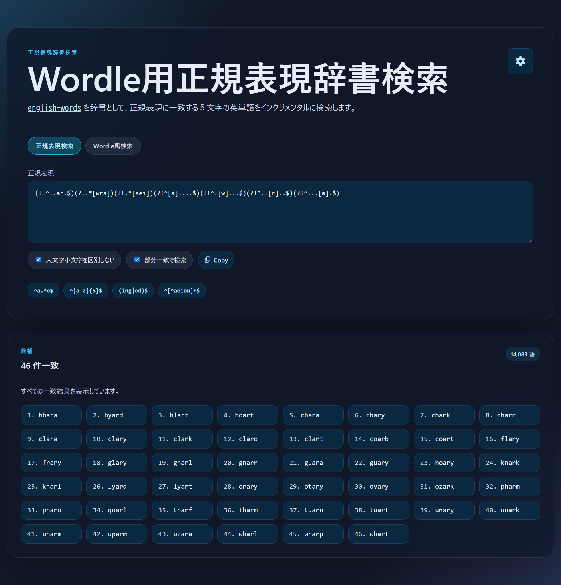
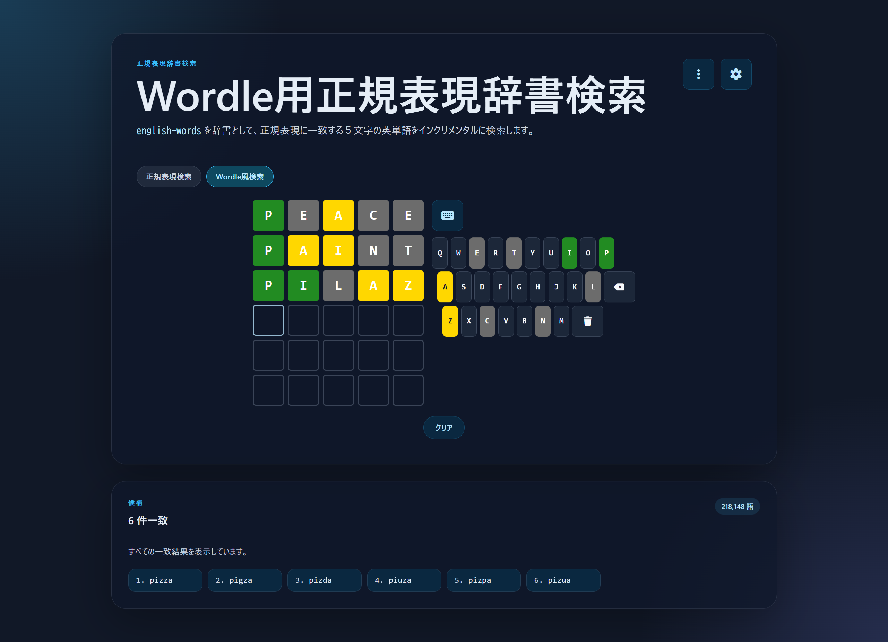
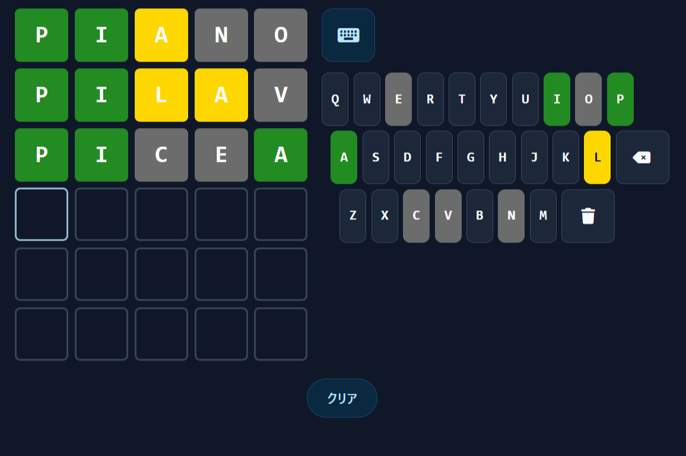

# 
## このアプリについて
いくつかの辞書・単語リストを基本データとしてWordle公式から収集した過去問でフィルタした
単語群から回答になりそうな単語の検索できます。
## 検索モード
当アプリでは２つの検索モードを利用できます。

正規表現検索

当アプリの基本機能です。検索したい条件を「パターン」という形式で記述して合致する単語を絞り込む方式です。
いろんな書き方があるので下記の専門サイトをご参照ください。

- [とほほの正規検索](https://www.tohoho-web.com/ex/regexp.html)

- 「正規表現」のテキストボックスに半角文字でパターンを入力します。
- 入力した正規表現に一致する単語が「候補」に表示されていきます。入力内容が更新されると自動的に更新されます。
- 「<i class="fa-regular fa-copy"></i>Copy」をクリックすると正規表現付きのURLとしてクリップボードにコピーすることができます

Wordle風検索

正規表現の検索パターンをWordle風のUI（タッチキーボードと文字グリッド）を使って構成して検索できるモードです。

それぞれの部分を以下のような名称となります。
- 文字グリッド（画面中央／左）
- タッチキーボード（画面右）

#### 使い方

- キーボードアイコン<i class="fa-solid fa-trash"></i>をクリックしてタッチキーボードを展開します。タッチキーボードを展開しなくても
  キーボード入力（アルファベット／BackSpace）には反応します。
- キーボード／タッチキーボードで文字を入力し、文字グリッドに入力された文字をクリックすることで「🟩（正解）」→「🟨（位置違い）」→「⬜️（含まれない）」 の順で変更できます。
- タッチキーボードの「<i class="fa-solid fa-delete-left"></i>」をクリックするかキーボードで`BackSpace`を押すと直前の文字を削除できます。
- タッチキーボードの「<i class="fa-solid fa-trash"></i>」をクリックすると入力中の行を削除できます。
- 「クリア」をクリックすると入力内容をすべて削除できます。

